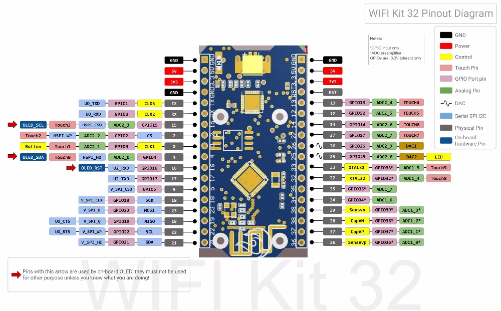

## Firmware

Na vývoj bol použitý [PlatformIO](https://docs.platformio.org/en/latest/). Použité knižnice sa automaticky stiahnú pri preklade programu; jedná sa o:

* [MFRC522](https://github.com/miguelbalboa/rfid) - *RFID modul,*
* [ESP8266_SSD1306](https://github.com/ThingPulse/esp8266-oled-ssd1306) - *OLED displej.*

Pred prekladom je potrebné nastaviť v súbore `src/wis_rfid.cpp` prihlasovacie údaje na Wifi - `ssid` a `password`, IP adresu a port servera - `host`. Pri zmenení makra `WPA2_ENTERPRISE` na `true` sa naviac použije aj autentizácia pomocou identity a hesla - `EAP_IDENTITY` a `EAP_PASSWORD`. Pre správnu rotáciu displeja sa v `setup()` odkomentuje riadok `display.flipScreenVertically()`. Podľa potreby sa dajú nastaviť piny na signály RST a SS pre RFID - `RST_PIN` a `SS_PIN`. Napinovanie je nasledujúce:
 * *RST/Reset - 1*
 * *SPI SS - 5*
 * *SPI MOSI - 23*
 * *SPI MISO - 19*
 * *SPI SCK - 18*

Po pripojení na Wifi je mikrokontrolér pripravený čitať ISIC karty. Z nich si vyčíta identifikátor UUID, ktorý pošle na server a obratom čaká login majiteľa karty. Pri úspechu ho vypíše na 5 sekúnd na displej. Inak čaká cca 10 sekúnd na odpoveď a vypíše chybu.
